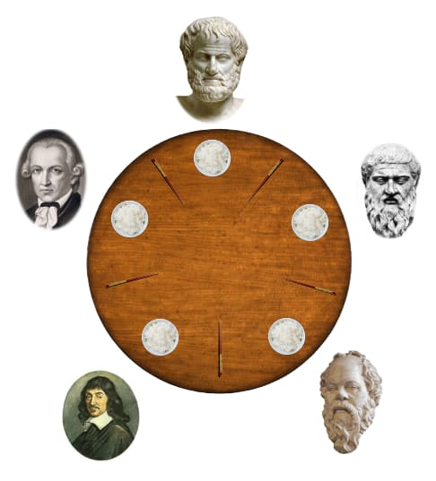

# Philosophers


## Description

This project is a simulation of [the dining philosophers problem](https://en.wikipedia.org/wiki/Dining_philosophers_problem) . The dining philosophers problem is a classic synchronization problem that is used to represent the challenges of deadlock and resource allocation in a concurrent system.

The project has two parts:
- philo: a simulation of the dining philosophers problem using threads and mutexes
- philo_bonus: a simulation of the dining philosophers problem using processes and semaphores

## Requirements
    - C compiler (gcc, clang)
    - Make

## Usage
- Clone the repository

Manditory:
```bash
cd philo
make
./philo number_of_philosophers time_to_die time_to_eat time_to_sleep [number_of_times_each_philosopher_must_eat]
```
Bonus:
```bash
cd philo_bonus
make
./philo number_of_philosophers time_to_die time_to_eat time_to_sleep [number_of_times_each_philosopher_must_eat]
```

## Rules
- Each philosopher is seated at a round table with a fork between each pair of philosophers.
- A philosopher can either be thinking, eating, or sleeping.
- A philosopher can only eat if they have both of their forks.
- A philosopher must sleep after eating.
- A philosopher dies if they do not start eating within `time_to_die` milliseconds after starting to sleep.


## Example
```bash
./philo 5 800 200 200
```
This will create a simulation with 5 philosophers, where each philosopher will die if they do not start eating within 800 milliseconds after starting to sleep. Each philosopher will eat for 200 milliseconds and sleep for 200 milliseconds.
